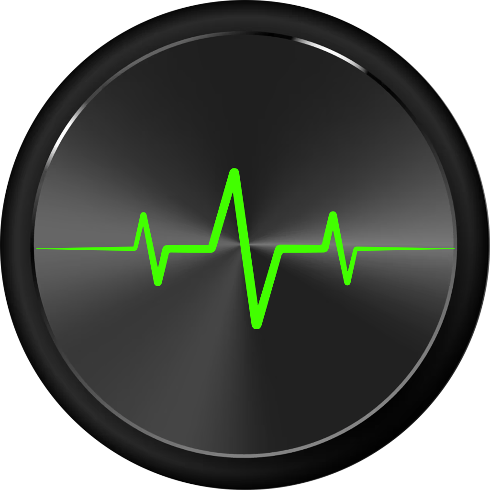

# HertzCast

<p align="center">
  
</p>

A native macOS application for controlling **Yamaha AV receivers** over your local network — no third-party apps, no subscriptions, no cloud.

**Website:** [thedanbutuc.github.io/HertzCast](https://thedanbutuc.github.io/HertzCast/)

<p align="center">
  
  &nbsp;&nbsp;
  
</p>

<p align="center">
  
  &nbsp;&nbsp;
  
</p>

<p align="center">
  
  &nbsp;&nbsp;
  
</p>

---

## Features

### Receiver Display
A retro LCD-style panel shows real-time receiver state, rendered in **Bitcount Prop Single ExtraLight** — a bitmap display font that matches the aesthetic of real audio equipment. The panel has a fixed size regardless of input source — layout never shifts when switching between sources.
- **Signal format** — audio codec, bit depth, and sample rate shown centered at the top when available (e.g. `PCM · 16-BIT · 44.1 KHZ`, `AAC · 320 KBPS · 44.1 KHZ`, `DOLBY DIGITAL PLUS · 48 KHZ`)
- **Current input source** — large phosphor-style display
- **Volume** — updates live in dB while dragging the knob; raw value as fallback
- **Sound mode** — DSP/surround program (Straight, Stereo, Surround Decoder, etc.)
- **Shuffle / Repeat indicators** — appear between the volume and mode readouts when active; `⇄` for shuffle, `↻` for repeat all, `↻1` for repeat one
- **Now Playing** — for Spotify and Net Radio inputs, shows the current track title and artist/station name, refreshed every 8 seconds; long names scroll continuously in a right-to-left marquee loop
- **Album art** — thumbnail with accent-colored border displayed for Spotify (always) and Net Radio (when the station provides it); gracefully falls back to text-only layout when unavailable
- **Mute indicator** — highlighted in red when active
- **Favourites heart** — while on Net Radio, a heart icon appears below the station name. Filled accent-colored heart = station is already saved in presets; empty heart = not yet saved. Tap to add or remove from Favourites instantly; shows an alert if all preset slots are full

### Power Control
A compact metallic circular button controls the receiver power state:
- Tap to toggle between **On** and **Standby**
- White power icon; glows with the accent color when the receiver is on
- Animated press feedback
- **Last-source restore**: powers back on to whichever input was active before standby

### Volume Control
A rotating metallic knob controls the receiver volume:
- **Graduation ring** — 31 tick marks around the knob, lit with the accent color up to the current level; MIN / MAX labels at the endpoints
- **Drag** to set volume — circular arc gesture; the knob rotates and the receiver volume changes in real time while dragging, with a single API call per integer step
- **Scroll wheel** — mouse wheel and trackpad both work
- **Keyboard shortcuts** — `Cmd ↑` / `Cmd ↓` volume up/down, `M` toggle mute, `P` play/pause, `S` shuffle, `R` repeat cycle, `Cmd ←` previous, `Cmd →` next

### Header Controls
Four metallic circular buttons in the window header — same design as the Mute button — give access to side panels:
- **Zone 2** (`⊟`) — open/close the Zone 2 panel
- **Music Center** (`♫`) — open/close the Music Center panel
- **Audio Settings** (`≡`) — open/close the Audio Settings panel
- **Settings** (`⚙`) — open/close the Settings panel
- Active panel button glows with the accent color; inactive buttons show white

### Mute
A dedicated Mute button sits next to the volume knob:
- White speaker icon; glows with the accent color when muted
- Toggles mute state on the receiver

### Input Source Buttons
Four physical keycap-style buttons for quick source switching, fully configurable in Settings:
- White label when inactive; accent-colored with a glow when active
- LED indicator dot below each button
- **Power-on shortcut**: tapping a source button while standby powers on directly to that source
- State syncs with the receiver within a few seconds

### Transport Controls
A compact set of transport buttons:

| Row | Buttons | Action |
|-----|---------|--------|
| 1 | `⇄` `⏮` `▶` `⏭` `↻` | Shuffle toggle / Previous / Play / Next / Repeat cycle |
| 2 | `<<` `■` `‖` `>>` | Tune − / Sound mode cycle / Band toggle (FM↔AM) / Tune + |
| 3 | `<` `>` | Preset − / Preset + |

Context-sensitive: `■` stops playback on streaming sources and cycles the sound program on Tuner; `‖` pauses on streaming and toggles FM/AM on Tuner; `< >` cycle through net presets on Net Radio and switch tuner presets on Tuner.

### Audio Settings
A dedicated panel (accessible via the sliders icon in the header) exposes the full YXC audio processing chain:
- **Subwoofer Volume** — slider from −12 to +12; double-click to reset to 0
- **Bass** — tone control bass slider from −12 to +12
- **Treble** — tone control treble slider from −12 to +12
- **Dialogue Level** — four metallic buttons (0–3) with active glow
- **Audio Features** — four toggle buttons on one row: Pure Direct / Enhancer / Extra Bass / Adaptive DRC
- **Sound Program** — full list fetched dynamically from the receiver via `getSoundProgramList`
- **Surround Decoder** — dropdown visible only when Sound Program is set to Surround Decoder

### Music Center
A panel (accessible via the music notes icon in the header) that slides in from the right, mutually exclusive with the other panels:
- **Recent Played** — list of recently played Net Radio stations; tap to recall and play. Each station has a heart button: tap to save it as a preset (plays it first, then stores), or remove it if already saved
- **Favourites** — receiver presets with accent-colored number badges (slot count read dynamically from the receiver — no fixed limit); tap to switch to Net Radio and recall preset. Each favourite has a filled heart; tap to remove it from presets. Right-click for a Delete context menu
- **Net Radio Browser** — full hierarchical browser for the Net Radio directory tree; navigate folders, search within any level, and tap a station to play instantly
- **Sources** — all available receiver inputs with SF Symbol icons; active source highlighted; tap to switch
- **Visible Sources** — toggle individual inputs on/off; hidden sources disappear from the Sources list
- All sections are collapsible `DisclosureGroup` menus with persistent open/closed state

### Theme
A pill-shaped Moon/Sun toggle in Settings switches between **Dark** and **Light** mode:
- **Dark mode** — green accent color, phosphor-style LCD, dark surfaces, glowing LEDs
- **Light mode** — red accent color, bold LCD font, light surfaces, no halos or glows

<p align="center">
  
  &nbsp;&nbsp;
  
</p>

### Schedule
Three schedule controls grouped in a collapsible section in Settings:

**Morning Alarm** — automatically powers on the receiver at a scheduled time:
- Enable/disable toggle
- Hour and minute picker
- **Day-of-week selector** — toggle individual days (Mo Tu We Th Fr Sa Su)
- **Source selector** — all supported YXC input sources
- **Preset picker** (1–5) for Net Radio
- **Wake volume** — set the volume level the receiver powers on at; separate from the current volume
- Managed via a background **Login Item** (`HertzCastHelper`) — fires even after Mac sleep/wake

**Auto Off** — automatically puts the receiver in standby at a scheduled time:
- Enable/disable toggle
- Hour and minute picker
- **Day-of-week selector** — same per-day granularity as Morning Alarm

**Sleep Timer** — turns the receiver off after a set time:
- Picker: Off / 15 / 30 / 45 / 60 / 90 / 120 minutes
- Applied instantly to the receiver; resets to Off on next power cycle

### Receiver Discovery
Automatically finds Yamaha receivers on the local network using Bonjour/mDNS:
- **Discover Receiver** button scans and verifies devices via the YXC API
- Auto-selects when exactly one receiver is found; shows a list for multiple
- Manual IP entry available as fallback

### Zone 2
A dedicated panel (accessible via the zone icon in the header) for controlling a secondary audio zone:
- **Power** — On/Standby button in the Zone 2 panel header, same design as the main power button
- **Input** — switch the Zone 2 input source independently
- **Volume** — slider + −/+ buttons; displays level in dB
- **Mute** — toggle Zone 2 mute
- Polled every 3 seconds; available on any Yamaha receiver with Zone 2 hardware output

### Menu Bar Mini Player
Clicking the menu bar icon opens a compact mini player instead of the full UI:
- Album art thumbnail + scrolling track title and artist name (Core Animation marquee)
- Playback controls: Previous / Stop / Play-Pause / Next / Shuffle / Repeat — keycap style matching the main UI
- Volume: − / dB label / + buttons + Mute
- Quit button
- Falls back gracefully when receiver is off or no track is playing

### Notifications
macOS notification when the receiver is turned on or off automatically by a schedule.

### Device Management
- **Reboot Receiver** — button at the bottom of Settings with confirmation dialog; sends `GET /system/requestSystemReboot` to restart the receiver remotely

---

## How It Works

The app communicates with the receiver using the **Yamaha Extended Control (YXC) HTTP API** over the local network. All requests are plain HTTP GET calls — no authentication required.

### API Endpoints Used

| Endpoint | Purpose |
|----------|---------|
| `GET /main/getStatus` | Power state, input, volume, mute, sound program, audio settings |
| `GET /main/setPower?power=on\|standby` | Power on / standby |
| `GET /main/setInput?input={input}` | Switch input source |
| `GET /main/setVolume?volume={n}` | Set volume level |
| `GET /main/setMute?enable=true\|false` | Mute / unmute |
| `GET /main/getSoundProgramList` | Fetch available DSP modes |
| `GET /main/setSoundProgram?program={p}` | Set DSP/surround mode |
| `GET /main/setSurroundDecoderType?type={t}` | Set surround decoder type |
| `GET /main/setPureDirect?enable=true\|false` | Pure Direct mode |
| `GET /main/setEnhancer?enable=true\|false` | Enhancer toggle |
| `GET /main/setExtraBass?enable=true\|false` | Extra Bass toggle |
| `GET /main/setAdaptiveDrc?enable=true\|false` | Adaptive DRC toggle |
| `GET /main/setToneControl?mode=manual&bass={n}&treble={n}` | Bass / Treble |
| `GET /main/setSubwooferVolume?volume={n}` | Subwoofer level |
| `GET /main/setDialogueLevel?value={n}` | Dialogue level (0–3) |
| `GET /main/getSignalInfo` | Current audio format and sample rate |
| `GET /netusb/recallPreset?zone=main&num={n}` | Recall Net Radio preset |
| `GET /netusb/storePreset?zone=main&num={n}` | Save currently playing station to preset slot |
| `GET /netusb/clearPreset?num={n}` | Remove a preset slot (delete from Favourites) |
| `GET /netusb/getPresetInfo` | Fetch saved presets (Favourites) |
| `GET /netusb/getRecentInfo` | Recently played Net Radio stations |
| `GET /netusb/recallRecentItem?num={n}&zone=main` | Play a recent station |
| `GET /netusb/getPlayInfo` | Now playing, playback state, shuffle/repeat, album art |
| `GET /netusb/setPlayback?playback={action}` | Play / pause / stop / previous / next |
| `GET /netusb/toggleShuffle` | Toggle shuffle on/off |
| `GET /netusb/toggleRepeat` | Cycle repeat mode (off → all → one) |
| `GET /netusb/getListInfo?input=net_radio&index={n}&size={n}&lang=en` | Net Radio directory listing (paged) |
| `GET /netusb/setListControl?list_id={layer}&type=select&index={n}&zone=main` | Navigate into a Net Radio folder |
| `GET /netusb/setListControl?list_id={layer}&type=play&index={n}&zone=main` | Play a Net Radio station |
| `GET /netusb/setSearchString?list_id={layer}&string={q}&index={n}&zone=main` | Search within Net Radio |
| `GET /tuner/getPlayInfo` | Tuner band and frequency |
| `GET /tuner/setBand?band=fm\|am` | Switch tuner band |
| `GET /tuner/setFreq?band={b}&tuning=up\|down` | Step tuner frequency |
| `GET /tuner/switchPreset?zone=main&dir=next\|previous` | Cycle tuner presets |
| `GET /main/setSleep?sleep={n}` | Sleep timer (0 = off, minutes) |
| `GET /system/getDeviceInfo` | Model name and firmware version |
| `GET /system/getFuncStatus` | Available input sources |
| `GET /system/requestSystemReboot` | Reboot the receiver |
| `GET /zone2/getStatus` | Zone 2 power, volume, mute, input |
| `GET /zone2/setPower?power=on\|standby` | Zone 2 power on / standby |
| `GET /zone2/setVolume?volume={n}` | Zone 2 volume |
| `GET /zone2/setMute?enable=true\|false` | Zone 2 mute |
| `GET /zone2/setInput?input={input}` | Zone 2 input source |

### Polling
- Receiver status polled continuously (debounced; UDP push events trigger immediate refresh)
- Now Playing info refreshed every **2 seconds** when input is Spotify or Net Radio
- Zone 2 status polled every **3 seconds**
- Album art prefetched into `URLCache` as soon as the URL is known — appears instantly on screen
- Optimistic UI updates: input and volume changes applied immediately, reverted on API failure

### Scheduling (HertzCastHelper)
Scheduling is handled by **HertzCastHelper** — a sandboxed background app bundled inside HertzCast and registered as a macOS **Login Item** via `SMAppService`. This replaces the previous `launchd` plist approach and is fully compatible with the macOS App Sandbox.

- The helper starts automatically at login and runs in the background
- It checks alarms at the start of every minute and immediately after the Mac wakes from sleep
- Settings are shared between the main app and the helper via **App Group UserDefaults** (`group.com.danbutuc.hertzcast`)
- The helper fires the same YXC HTTP calls directly — no dependency on the main app being open

---

## Technology Stack

| Layer | Technology |
|-------|-----------|
| Language | Swift 5 |
| UI Framework | SwiftUI |
| Networking | URLSession (native, no dependencies) |
| Scheduling | `HertzCastHelper` Login Item via `SMAppService` |
| Persistence | App Group UserDefaults / AppStorage |
| Notifications | UserNotifications framework |
| Fonts | Bitcount Prop Single ExtraLight + Regular (OFL) |
| Project | XcodeGen (`project.yml`) → `HertzCast.xcodeproj` |
| Build (dev) | `swiftc` via `scripts/build.sh` |
| Distribution | DMG (ad-hoc signed) / Mac App Store |

No external Swift packages. No CocoaPods. No SPM dependencies. Pure Apple frameworks only.

---

## Requirements

- macOS 13.0 (Ventura) or later
- Yamaha receiver with YXC API support on the same local network
- The app is **sandboxed** and App Store compatible — no special permissions required

---

## Getting Started

### 1. Install

1. Download `HertzCast-v2.2.1.dmg` from [Releases](../../releases)
2. Open the DMG and drag **HertzCast** to your Applications folder
3. Launch **HertzCast** — it will appear in your menu bar as a small icon

### 2. Connect to Your Receiver

HertzCast communicates with your Yamaha receiver over your local Wi-Fi or Ethernet network.

**Automatic discovery (recommended):**

1. Click the HertzCast icon in the menu bar
2. Click the **gear icon** (⚙) to open Settings
3. Click **Discover Receiver** — the app will scan your network and find your Yamaha automatically
4. If a single receiver is found it is selected automatically; if multiple are found, choose yours from the list

**Manual entry (fallback):**

1. Find your receiver's IP address — check your router's connected devices list or the receiver's network settings menu
2. In Settings, click the IP address field and type the address (e.g. `192.168.1.45`), then press Return

### 3. You're Ready

Once connected, the menu bar icon turns **green** when your receiver is on and **red** when it is in standby. Click the icon to open the full controller.

The theme defaults to **Dark** mode. Switch to **Light** mode anytime via the Moon/Sun toggle in Settings.

---

## Building from Source

### Using Xcode (recommended)

```bash
git clone https://github.com/theDanButuc/HertzCast.git
cd HertzCast
brew install xcodegen
xcodegen generate
open HertzCast.xcodeproj
```

Build and run the **HertzCast** scheme in Xcode.

### Using the build script (dev DMG)

```bash
bash scripts/build.sh
```

Requires Xcode Command Line Tools (`xcode-select --install`). Compiles only the main app target with `swiftc`, signs ad-hoc, and produces a DMG in `dist/`. Does not build `HertzCastHelper` — scheduling features require an Xcode build.

---

## Project Structure

```
HertzCast/
├── AppDelegate.swift               # NSStatusItem, NSPopover, menu bar icon, main menu
├── HertzCastApp.swift              # App entry point (@main), WindowGroup + Settings scene
├── Views/
│   ├── MainWindowView.swift        # Main window layout with sliding left/right panels
│   ├── PopoverView.swift           # Menu bar popover layout
│   ├── ReceiverDisplayView.swift   # LCD-style display with Bitcount font, album art, marquee
│   ├── ManualControlsView.swift    # Power button + volume knob + mute button
│   ├── VolumeKnobView.swift        # Rotating metallic knob with rotational drag gesture
│   ├── PowerButtonView.swift       # Circular metallic power button
│   ├── SceneButtonsView.swift      # Input source keycap buttons
│   ├── TransportControlsView.swift # Transport buttons incl. shuffle and repeat
│   ├── KeycapComponents.swift      # Shared keycap shape and press style
│   ├── AudioSettingsView.swift     # Audio panel: tone, subwoofer, features, sound program
│   ├── MusicCenterView.swift       # Music Center: recent played, favourites, net radio browser, sources
│   ├── NetRadioBrowserView.swift   # Hierarchical Net Radio browser with search
│   ├── ThemeToggleView.swift       # Moon/Sun pill toggle for Dark/Light mode
│   ├── SettingsView.swift          # IP + theme toggle + source buttons + schedule + sleep timer + reboot
│   ├── MorningAlarmView.swift      # Morning alarm controls incl. wake volume
│   ├── AutoOffView.swift           # Auto off controls
│   ├── Zone2View.swift             # Zone 2: power, input, volume, mute
│   └── AboutView.swift             # About panel with version, model, firmware
├── Models/
│   ├── HertzSettings.swift         # App Group UserDefaults-backed settings
│   ├── AppUIState.swift            # Panel visibility state — mutual exclusion
│   ├── AppColors.swift             # Color scheme extension
│   └── NetRadioBrowserState.swift  # Net Radio browser navigation stack + search state
├── Services/
│   ├── HertzAPIService.swift       # All YXC HTTP calls + polling + models
│   ├── SchedulerService.swift      # SMAppService Login Item registration/unregistration
│   └── DiscoveryService.swift      # Bonjour/mDNS receiver discovery
├── Resources/
│   ├── Volume.png                  # Metallic knob asset
│   ├── Button.png                  # Circular button asset
│   ├── BitcountPropSingle-ExtraLight.ttf
│   └── BitcountPropSingle-Regular.ttf
├── HertzCast.entitlements          # App Store / sandbox entitlements
├── HertzCast-dev.entitlements      # Dev entitlements (no sandbox, for build.sh)
└── Info.plist

HertzCastHelper/
├── main.swift                      # Background Login Item: alarm checker + wake listener
├── HertzCastHelper.entitlements
└── Info.plist

project.yml                         # XcodeGen project definition (both targets)
scripts/
└── build.sh                        # swiftc dev build + DMG
```

---

## Settings Persistence

All settings stored in **App Group UserDefaults** (`group.com.danbutuc.hertzcast`) — shared between the main app and `HertzCastHelper`:

| Key | Type | Description |
|-----|------|-------------|
| `yamaha_ip` | String | Receiver IP address |
| `app_theme` | String | UI theme (`dark` or `light`) |
| `button1_source` … `button4_source` | String | Input source for each scene button |
| `last_input` | String | Last active input — restored on manual power on |
| `morning_enabled` | Bool | Morning alarm toggle |
| `morning_hour` | Int | Alarm hour (0–23) |
| `morning_minute` | Int | Alarm minute (0–59) |
| `morning_source` | String | Input source for morning alarm |
| `morning_preset` | Int | Net Radio preset (1–5) |
| `morning_weekdays` | [Int] | Selected days (0=Sun … 6=Sat); default all 7 |
| `autooff_enabled` | Bool | Auto off toggle |
| `autooff_hour` | Int | Auto off hour (0–23) |
| `autooff_minute` | Int | Auto off minute (0–59) |
| `autooff_weekdays` | [Int] | Selected days (0=Sun … 6=Sat); default all 7 |
| `morning_volume` | Int | Wake volume level for Morning Alarm |
| `hidden_sources` | [String] | Input sources hidden from Music Center Sources list |
| `mc_recent_expanded` | Bool | Music Center — Recent Played section open/closed |
| `mc_favourites_expanded` | Bool | Music Center — Favourites section open/closed |
| `mc_sources_expanded` | Bool | Music Center — Sources section open/closed |
| `mc_browse_expanded` | Bool | Music Center — Browse Net Radio section open/closed |

---

## License

MIT License. Feel free to use HertzCast and contribute.
